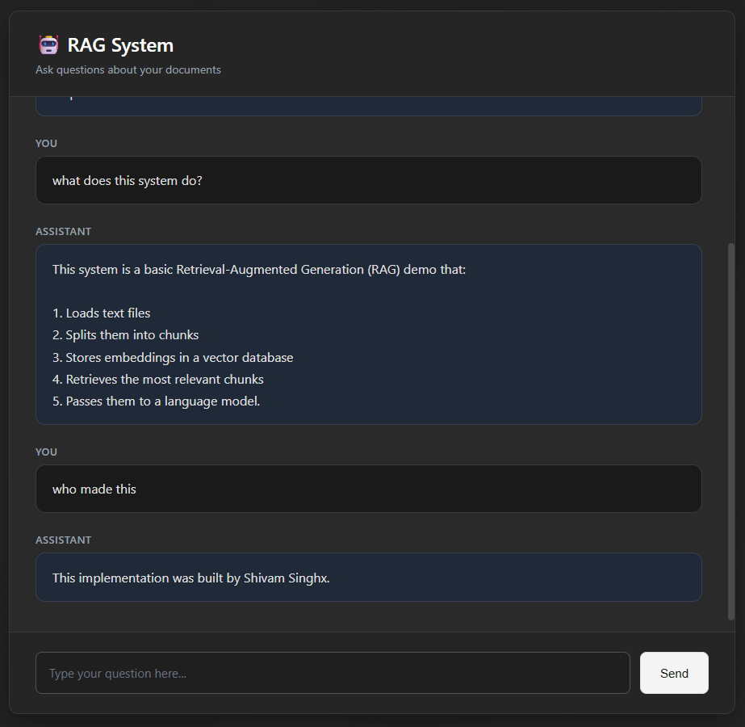

# 🤖 RAG System Demo

A minimal Retrieval-Augmented Generation (RAG) system built with Flask, ChromaDB, and Groq's LLM API. Features a clean, aesthetic web interface for asking questions about your documents.



## ✨ Features

- 📚 Document ingestion and chunking
- 🔍 Semantic search using sentence transformers
- 🤖 AI-powered answer generation with Groq LLM
- 🎨 Beautiful, minimal HTML/CSS frontend
- 💾 Vector storage with ChromaDB

## 🛠️ Tech Stack

- **Backend**: Flask
- **Vector Database**: ChromaDB
- **Embeddings**: Sentence Transformers (all-MiniLM-L6-v2)
- **LLM**: Groq (llama-3.3-70b-versatile)
- **Frontend**: HTML/CSS/JavaScript

## 📋 Prerequisites

- Python 3.8+
- Groq API key ([Get one here](https://console.groq.com/))

## 🚀 Installation

1. **Clone the repository**
   ```bash
   git clone <your-repo-url>
   cd Rag
   ```

2. **Create a virtual environment**
   ```bash
   python -m venv venv
   venv\Scripts\activate  # Windows
   ```

3. **Install dependencies**
   ```bash
   pip install -r requirements.txt
   ```

4. **Set up environment variables**
   - Create a `.env` file in the project root
   - Add your Groq API key:
     ```
     GROQ_API_KEY=your_api_key_here
     ```

5. **Build the index**
   ```bash
   python build_index.py
   ```
   Place your `.txt` documents in the `data/` folder before running this.

## 🎯 Usage

1. **Start the Flask server**
   ```bash
   python app.py
   ```

2. **Open your browser**
   Navigate to `http://localhost:5000`

3. **Ask questions**
   Type your question in the text area and click "Get Answer"

## 📁 Project Structure

```
Rag/
├── app.py              # Flask web application
├── rag_core.py         # Core RAG logic (retrieve + generate)
├── build_index.py      # Document indexing script
├── data/               # Place your .txt documents here
├── templates/          # HTML templates
│   └── index.html      # Frontend UI
├── chroma_store/       # Vector database (auto-generated)
├── .env                # Environment variables (not in git)
├── .gitignore          # Git ignore rules
└── requirements.txt    # Python dependencies
```

## 🔧 How It Works

1. **Indexing**: Documents are loaded from `data/`, split into chunks, embedded using sentence transformers, and stored in ChromaDB
2. **Retrieval**: User queries are embedded and compared against stored chunks to find the most relevant context
3. **Generation**: Retrieved chunks are passed to Groq's LLM with the query to generate an accurate answer

## 📝 Example Questions

- "What is this project about?"
- "How does the RAG system work?"
- "What technologies are used?"

## 🔒 Security Notes

- Never commit your `.env` file
- Keep your Groq API key secret
- The `.gitignore` file is configured to exclude sensitive files

## 🤝 Contributing

Feel free to fork this project and submit pull requests!

## 📄 License

MIT License

## 🙏 Acknowledgments

- [Groq](https://groq.com/) for fast LLM inference
- [ChromaDB](https://www.trychroma.com/) for vector storage
- [Sentence Transformers](https://www.sbert.net/) for embeddings

---

Made with ❤️ for learning RAG systems
